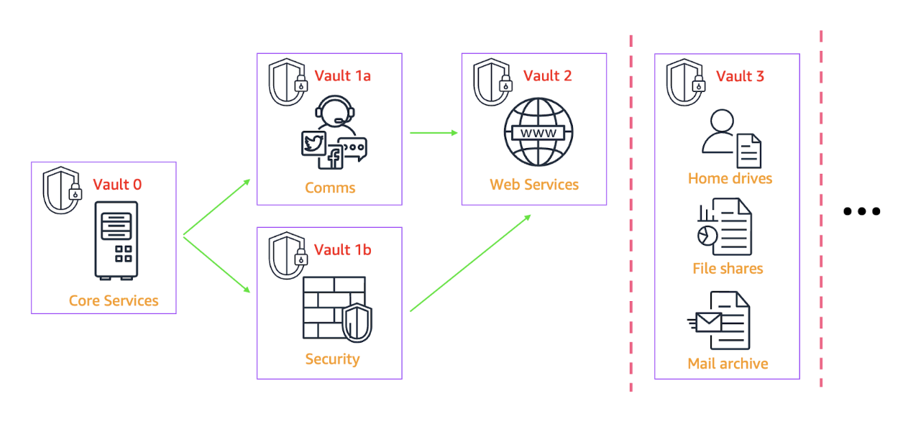
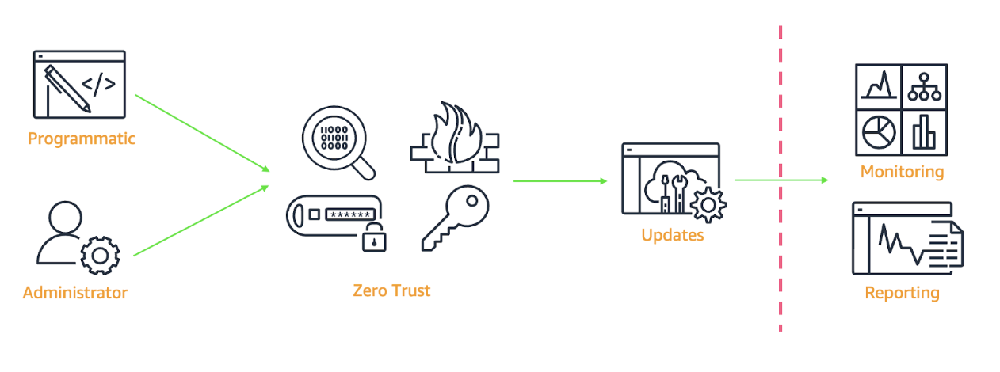

# Khả năng phục hồi trong thiết kế: Xây dựng chiến lược khôi phục hiệu quả trước ransomware

Các sự cố ransomware đã trở thành một vấn đề được ưu tiên trong các cuộc họp lãnh đạo của các tổ chức hiện đại. Dữ liệu cho thấy một xu hướng rõ ràng: số lượng sự cố ransomware đã tăng hơn gấp đôi kể từ khi đại dịch bắt đầu, trong đó lĩnh vực dịch vụ tài chính đặc biệt bị nhắm mục tiêu nhiều. Tại AWS, sự hợp tác đa lĩnh vực của chúng tôi với các khách hàng trong ngành dịch vụ tài chính toàn cầu, cơ quan quản lý, tổ chức điều hành và các đối tác trong ngành đã tạo ra một kiến trúc được chứng nhận cho Cloud Hosted Data Vault (CHDV), hay còn gọi ngắn gọn là vault.

Vault là một yếu tố then chốt trong việc tăng cường khả năng phục hồi vận hành (operational resilience) trước các sự cố mạng quy mô lớn. Vault đóng vai trò như một tuyến phòng thủ cuối cùng, được cách ly hoàn toàn, bảo vệ những tài sản có tính nhiệm vụ quan trọng nhất của tổ chức bạn. Nó cho phép doanh nghiệp của bạn có thể phục hồi nếu các cơ chế truyền thống như High Availability (HA), Business Continuity (BC), Disaster Recovery (DR) và backup không còn đảm bảo được khả năng khôi phục. Việc tích hợp vault vào các thực hành resilience hiện có của bạn đòi hỏi phải lập kế hoạch cẩn thận trên nhiều phương diện. Trong bài viết này, chúng tôi sẽ xem xét những yếu tố cần cân nhắc khi lập kế hoạch, và cách bạn có thể bổ sung thêm các lớp bảo vệ cho các giải pháp HA, BC/DR và backup hiện có. Chúng tôi cũng sẽ đề cập đến các yếu tố chính không chỉ trong việc triển khai công nghệ mà còn về con người, quy trình và những yếu tố thực tiễn giúp vault hoạt động hiệu quả như một giải pháp hoàn chỉnh.

---

## 1. Cần đưa những gì vào vault?

Mỗi chủ sở hữu đơn vị kinh doanh đều sẽ nói rằng “mọi thứ, ở mọi nơi” đều cần được bảo vệ. Thực tế thì không phải vậy — hoặc ít nhất là không phải ngay lập tức. Khi suy nghĩ về một sự cố mạng quy mô lớn, rất dễ rơi vào suy nghĩ rằng tất cả dữ liệu, ứng dụng và dịch vụ đều quan trọng và cần được đưa vào vault. Bạn có thể cho rằng, nếu một thành phần đang tồn tại trong môi trường production thì chắc chắn nó cần thiết. Tuy nhiên, việc cố gắng đưa mọi thứ vào vault mà không có bước xem xét ban đầu hợp lý có thể dẫn đến khối lượng dữ liệu khổng lồ, chi phí cao, và độ trễ khôi phục ngoài ý muốn.

Trong một sự cố mạng thực sự, bạn cần tự hỏi: đâu là các chức năng CNTT cốt lõi và dịch vụ vận hành mà bạn cần để khởi động lại hoạt động kinh doanh trong 12, 24 hoặc 48 giờ tới — và quan trọng không kém là, những gì không cần thiết? Những chức năng và dịch vụ cốt lõi này thường được gọi là Minimum Viable Business (MVB) — tức là phần tối thiểu cần thiết để doanh nghiệp duy trì hoạt động. Chúng không chỉ bao gồm các dịch vụ dành cho khách hàng của bạn, mà còn cả cho đối tác cấp hai, cấp ba và cấp bốn.

Hình 1: Cần đưa những gì vào vault? – Tập trung vào các chức năng CNTT cốt lõi và các dịch vụ vận hành.

Câu hỏi này không thể được trả lời trong một sớm một chiều. Vault không chỉ là một giải pháp công nghệ — nó đòi hỏi sự tham gia từ nhiều bộ phận khác nhau. Việc xác định MVB của bạn và cách bảo vệ nó tốt nhất phụ thuộc vào ý kiến, kinh nghiệm và kiến thức tổng hợp từ nhiều nhóm: CNTT, bảo mật, pháp lý, các chủ sở hữu đơn vị kinh doanh, chủ sở hữu ứng dụng và các lãnh đạo cấp cao.

---

## 2. Khôi phục sẽ trông như thế nào?

Các sự cố mạng được thiết kế để khiến việc khôi phục hệ thống hoặc dịch vụ của bạn trở nên khó khăn — thậm chí là gần như không thể — thông qua các cơ chế khôi phục vận hành tiêu chuẩn như HA, BC, DR và Backup. Những kẻ tấn công muốn gây gián đoạn tối đa với khả năng khôi phục tối thiểu, nhằm buộc nạn nhân phải trả tiền chuộc.

Một sự cố mạng quy mô lớn không thể chỉ dựa vào các phương thức khôi phục vận hành thông thường, do đó bạn cần chuẩn bị trước một số yếu tố quan trọng sau đây để ứng phó hiệu quả.

**Decision Time Objective (DTO):** Mất bao lâu để kích hoạt quá trình khôi phục từ vault?  
Các quy trình khôi phục được tự động hóa cao trong những môi trường an toàn, đáng tin cậy có thể đã bị xâm phạm, dẫn đến mất độ tin cậy hoặc không thể sử dụng được do hành động phá hoại. Vì vậy, điều quan trọng là phải điều phối con người và các điểm ra quyết định then chốt về thời điểm cần kích hoạt khôi phục toàn phần hoặc một phần từ vault.

**Cyber-Recovery Time Objective (C-RTO) và Cyber-Recovery Point Objective (C-RPO):**  
Cần điều chỉnh kỳ vọng về thời gian khôi phục, xem xét mức độ ảnh hưởng và thời gian phục hồi tăng lên trong trường hợp xảy ra sự cố mạng. Những quy trình từng chỉ mất vài giây giờ đây có thể kéo dài nhiều ngày, và doanh nghiệp cần chuẩn bị kế hoạch phản ứng phù hợp cho tình huống này.

**Minimum Acceptable Service Offering (MASO):**  
Trong khi MVB tập trung vào hoạt động nội bộ của doanh nghiệp bạn, thì MASO đặt câu hỏi: mức độ dịch vụ tối thiểu nào có thể chấp nhận được để cung cấp cho khách hàng và các bên thứ ba?  
Điều này có thể bao gồm một phần chức năng giới hạn của dịch vụ chính, hoặc một hệ thống dự phòng được truy cập thông qua phương thức thay thế khác.

Hình 2: Khôi phục sẽ trông như thế nào? – Những gì thường diễn ra trong vài giây có thể kéo dài nhiều ngày, hãy lập kế hoạch trước.

---

## 3. Vault sẽ được phân vùng như thế nào?

Dù bạn lựa chọn một vault cho toàn bộ hệ thống hay mỗi dịch vụ một vault riêng, điều quan trọng là phải đạt được sự cân bằng giữa khả năng quản lý, tính thực tiễn và mức độ bảo mật.

**Sự đơn giản:** Giữ cho các vault rõ ràng, dễ hiểu, dễ điều hướng và dễ khôi phục nhất có thể. Sự phức tạp chỉ khiến quá trình khôi phục bị trì hoãn.

**Tính độc lập:** Mỗi vault nên hoạt động độc lập để giảm thời gian chờ đợi và tăng khả năng thực hiện song song trong quá trình khôi phục.

**Ánh xạ dịch vụ:** Xác định điểm bắt đầu khôi phục ở đâu và thứ tự khôi phục tối ưu là gì.

**Vai trò và trách nhiệm:** Các chủ sở hữu và quản trị viên cần được phân bổ rõ ràng theo dịch vụ, ứng dụng và hạ tầng mà họ phụ trách.

**Bảo trì:** Vault không phải là một thực thể tĩnh, vì ứng dụng luôn được cập nhật và các trường hợp sử dụng của doanh nghiệp thay đổi theo thời gian.

Hình 3: Vault sẽ được phân vùng như thế nào? – Cân bằng giữa khả năng quản lý, nội dung và quy trình khôi phục.

Tính linh hoạt mà AWS mang lại là vô giá, vì nó cho phép bạn thử nghiệm, thất bại và lặp lại để tìm ra giải pháp tối ưu mà không tạo ra “khoản nợ kỹ thuật” trong quá trình đó. Những gì có vẻ khả thi trên bảng vẽ có thể thất bại ngay trong bài kiểm thử đầu tiên, và bài học rút ra từ đó có thể được áp dụng cho phiên bản vault tiếp theo. Việc có khả năng thích ứng linh hoạt với nhu cầu kinh doanh giúp tăng mức độ tin cậy vào giải pháp cũng như quy trình khôi phục. Những gì được đưa vào vault không chỉ là dữ liệu, mà còn cần có đóng góp từ các chủ sở hữu ứng dụng và các đơn vị kinh doanh.

---

## 4. Làm thế nào để quản lý vault?

Vault của bạn cần được tách khỏi mặt phẳng vận hành (operational plane) để bất kỳ sự cố mạng nào lan rộng trong môi trường production đều bị chặn lại ngay tại ranh giới của vault. Nếu không có mức độ tách biệt này, vault cũng có thể bị xâm phạm trong sự cố mạng.

Các giải pháp air-gapped truyền thống thường bao gồm cách ly vật lý, chẳng hạn như rút dây kết nối hoặc tháo phương tiện lưu trữ, tạo ra khoảng trống thực sự (“air gap”) giữa cơ chế bảo vệ và môi trường vận hành.  
Vậy làm thế nào để chuyển khái niệm cách ly này lên môi trường cloud và vault?  
Việc tái tạo các biện pháp bảo mật tương đương trên đám mây đòi hỏi:

- **Vùng truy nhập:** Các khu vực, dịch vụ và chức năng chỉ tồn tại tạm thời và chỉ khả dụng trong thời gian được cấp quyền truy cập.  
- **Xác thực đa yếu tố:** Sử dụng thiết bị xác thực vật lý (physical tokens), chỉ có nhân sự được ủy quyền mới được phép truy cập.  
- **Zero trust:** Áp dụng xác thực ở mọi bước, không giả định bất kỳ thành phần nào là đáng tin cậy mặc định.  
- **AWS Identity and Access Management (IAM):** Thiết lập vai trò và quyền hạn giới hạn nghiêm ngặt, đảm bảo nguyên tắc phân quyền tối thiểu (least privilege).  
- **Quản lý thay đổi:** Chỉ cho phép truy cập vào token và tài khoản thông qua quy trình phê duyệt chính thức.

Hình 4: Làm thế nào để quản lý vault? – Cách ly có chủ đích nhưng vẫn duy trì khả năng quan sát.

---

## 5. Làm thế nào để lập kế hoạch cho khâu hậu cần và nhà cung cấp dịch vụ?

Các giải pháp vật lý thường bị bỏ qua khi xem xét cách ứng phó với một sự cố mạng. Khi tập trung vào các dịch vụ cốt lõi, ứng dụng và hạ tầng nền tảng, chúng ta thường không chú ý đến các phụ thuộc vật lý bên ngoài, vốn cũng đóng vai trò quan trọng trong quá trình khôi phục.

Ví dụ:

- **Truy cập mạng nội bộ và bên ngoài:** Không cần đến một thảm họa lớn để gây chú ý - mất kết nối mạng gây gián đoạn dịch vụ cũng đủ để trở thành vấn đề nghiêm trọng.  
- **Kho lưu trữ phần mềm:** Việc phân phối phần mềm tự động có nghĩa là bạn vẫn nên duy trì phương tiện lưu trữ vật lý, chẳng hạn như USB, được cất giữ sẵn để truy cập mà không phụ thuộc vào hạ tầng số.  
- **Chuỗi cung ứng:** Khi thiết bị vật lý bị hư hỏng hoàn toàn, cần có kế hoạch và quy trình rõ ràng để vận chuyển và cung cấp phần cứng đến đúng nơi, với số lượng cần thiết.  
- **Hậu cần vật lý:** Nếu một sự cố quy mô lớn đòi hỏi phản ứng tương xứng, vậy làm thế nào để bố trí nhân sự, thiết bị và không gian làm việc một cách kịp thời?

Hình 5: Hậu cần và nhà cung cấp dịch vụ – Mở rộng kế hoạch để bao gồm cả các phụ thuộc bên ngoài.

Mức độ tinh vi của một sự cố mạng có thể nằm ở việc gây ra nhiều lỗi cùng lúc, mà nếu xét riêng lẻ trong hoạt động kinh doanh thông thường thì chỉ có tác động nhỏ và được dự đoán trước. Tuy nhiên, khi những lỗi này xảy ra đồng thời trên diện rộng, chúng có thể tạo ra hiệu ứng cộng dồn, khiến quá trình khắc phục trở nên phức tạp hơn và bị trì hoãn.

---

## 6. Ai là người chịu trách nhiệm cho quy trình vaulting?

Con người sẽ là những người chịu trách nhiệm quản lý và vận hành quy trình cyber vaulting, đưa ra các best practices, và trực tiếp tham gia tuyến đầu khi cần thực hiện khôi phục. Việc lựa chọn đội ngũ chịu trách nhiệm là yếu tố then chốt, nhưng không phải lúc nào cũng đơn giản.

Các nguyên tắc của vault được xây dựng dựa trên thực tế rằng nó bao gồm nhiều khía cạnh khác nhau như bảo vệ, lập kế hoạch và quy trình, và vì vậy cần có sự đóng góp từ nhiều bên liên quan, chứ không thể chỉ đến từ một nhóm duy nhất.

Các bên liên quan trong doanh nghiệp (business stakeholders) — chứ không phải nhóm backup — nên điều phối thứ tự ưu tiên khôi phục, dựa trên hiểu biết về các phụ thuộc hệ thống, yêu cầu tuân thủ và tác động đến hoạt động kinh doanh. Việc giao tiếp rõ ràng giữa nhóm kỹ thuật và nhóm kinh doanh là yếu tố thiết yếu để xây dựng kế hoạch khôi phục sau sự cố mạng hiệu quả.

Hình 6: Con người và quy trình – Cân bằng hai yếu tố này là nền tảng cho các thực hành tốt.

Kết quả của sự hợp tác đa chức năng này là các kế hoạch khôi phục mà doanh nghiệp của bạn phải áp dụng và tuân thủ. Tuy nhiên, điều này đôi khi vô tình tạo ra những kịch bản khôi phục kém hiệu quả, do các quy trình quá rườm rà có thể dẫn đến thực hành sai lệch.

Những thủ tục phức tạp, thiếu tính linh hoạt, cùng với xu hướng con người chọn con đường ít cản trở nhất, có thể khiến kế hoạch khôi phục dù tốt đến đâu cũng không được thực thi đúng cách. Mặc dù điều này không ảnh hưởng ngay lập tức đến bảo mật hoặc quy trình khôi phục, nhưng thời điểm tồi tệ nhất để phát hiện rằng các nguyên tắc của vault chưa được áp dụng chính là khi bạn cần đến chúng.

Để đảm bảo khôi phục hiệu quả sau sự cố mạng, tổ chức của bạn cần tích hợp liền mạch các best practices vào hoạt động hằng ngày. Việc tích hợp này đòi hỏi phải duy trì sự cân bằng tinh tế giữa yêu cầu khôi phục mạnh mẽ và các quy trình thực tiễn, bền vững, để các nhóm có thể tuân thủ nhất quán mà không làm ảnh hưởng đến bảo mật hay hiệu suất vận hành.

---

## 7. Tại sao cần có sự bảo trợ?

Không thể phủ nhận rằng bất kỳ công việc bổ sung nào trong tổ chức cũng sẽ tăng thêm chi phí và nỗ lực, đồng thời làm phân tán thời gian và nguồn lực khỏi các hoạt động phát triển kinh doanh khác. Không có Giám đốc tài chính (CFO) nào lại không đặt câu hỏi về việc tại sao một giải pháp công nghệ lại tiêu tốn thời gian, tiền bạc và công sức mà không tạo ra doanh thu.

Vault không phải là một phần hoạt động chủ chốt trong doanh nghiệp của bạn. Vì vậy, điều quan trọng là giá trị nội tại và mục đích sử dụng của nó phải được thấu hiểu rõ ràng. Điều này chỉ có thể đạt được khi có sự bảo trợ và định hướng từ cấp lãnh đạo cao nhất — tức là sự cam kết “từ trên xuống” (top-down) của ban điều hành.

Hình 7: Sự bảo trợ – Cách tiếp cận từ trên xuống định hướng cho toàn bộ doanh nghiệp.

---

## Bắt đầu với AWS

AWS cung cấp nhiều lớp phòng thủ chống lại các sự kiện ransomware. Để bảo vệ dữ liệu ngay lập tức trên nhiều dịch vụ dữ liệu AWS, AWS Backup cung cấp khả năng quản lý sao lưu tập trung với các bản sao lưu bất biến và khả năng “cách ly logic”, giúp ngăn chặn việc sửa đổi trái phép và cho phép khôi phục nhanh chóng. Amazon S3 với versioning và Object Lock, cùng với Amazon FSx for NetApp ONTAP, tạo ra môi trường lưu trữ chống giả mạo cho dữ liệu quan trọng.

Về mặt phát hiện, Amazon GuardDuty giám sát hoạt động đáng ngờ, trong khi AWS Security Hub cung cấp cái nhìn tổng thể về tình hình bảo mật. Amazon Macie xác định dữ liệu nhạy cảm có thể bị nhắm mục tiêu, trong khi AWS Shield và AWS WAF bảo vệ trước các cuộc tấn công DDoS và khai thác web. AWS Network Firewall lọc lưu lượng độc hại ở cấp mạng. Các đối tác như elastio tích hợp với AWS Backup giúp tổ chức xác minh tính toàn vẹn của dữ liệu gần như theo thời gian thực, từ đó cho phép khôi phục “sạch” với thời gian ngừng hoạt động và mất dữ liệu tối thiểu.

Về bảo vệ danh tính, IAM triển khai nguyên tắc “quyền truy cập tối thiểu”, trong khi AWS Organizations cho phép quản lý chính sách bảo mật tập trung trên nhiều tài khoản. AWS Config và AWS CloudTrail cung cấp khả năng theo dõi thay đổi cấu hình và hoạt động API, điều rất cần thiết cho phân tích pháp y sau sự cố.

---

## Kết luận

Các sự kiện mạng, đặc biệt là ransomware, đang gia tăng hàng năm. Sự chuyển dịch từ việc bảo vệ trước các sự cố ngẫu nhiên sang đối phó với các cuộc tấn công có chủ đích đòi hỏi doanh nghiệp phải phản ứng nhanh để thu hẹp “cửa sổ rủi ro” – nơi mà một sự cố nghiêm trọng có thể khiến dịch vụ tê liệt, thậm chí làm doanh nghiệp ngừng hoạt động.

Giải pháp công nghệ chỉ là một phần của phương trình. Việc lên kế hoạch phản ứng trước gián đoạn có chủ đích là yếu tố then chốt giúp loại bỏ những giả định sai lệch trong vận hành hằng ngày. Một sự cố mạng không phải là hoạt động thường nhật, và vì vậy cần được chuẩn bị và lập kế hoạch phù hợp để những quyết định quan trọng không bị đưa ra trong tình huống khẩn cấp.

Tăng cường khả năng phục hồi mạng (cyber resilience) đòi hỏi một chiến lược toàn diện ở cấp tổ chức. Hãy bắt đầu bằng cách xác định thế nào là khôi phục thành công đối với hoạt động kinh doanh của bạn, sau đó xây dựng và chuẩn bị cho các kịch bản tồi tệ nhất thông qua kế hoạch chi tiết. Liên tục lặp lại, kiểm tra và xác thực các quy trình khôi phục để đảm bảo chúng thực sự hoạt động khi cần thiết.

Quan trọng hơn hết, khả năng phục hồi mạng vượt xa phạm vi của bộ phận CNTT — đây là thách thức mang tính toàn doanh nghiệp. Mọi bộ phận, từ vận hành, tài chính đến lãnh đạo và nhân viên tuyến đầu, đều đóng vai trò quan trọng trong việc xây dựng và thực thi khả năng phục hồi khi sự cố xảy ra. Thành công phụ thuộc vào việc biến khả năng phục hồi mạng trở thành trách nhiệm chung của toàn tổ chức, từ CEO đến quản trị viên hệ thống.

---

## Tác giả

**Tom Tasker**  
Tom là một Storage Solution Architect phụ trách Global Financial Services tại Amazon Web Services. Anh làm việc với các công ty dịch vụ tài chính lớn và có tầm ảnh hưởng nhất thế giới, các cơ quan quản lý và các đối tác, nhằm thúc đẩy các giải pháp được tích hợp và vận hành trên nền tảng AWS storage.

**Danny Johnston**  
Danny là người đứng đầu Global Financial Services Storage Business Development Team tại Amazon Web Services. Anh là một chuyên gia phát triển kinh doanh dày dạn kinh nghiệm, chuyên về các giải pháp enterprise storage, thúc đẩy các quan hệ đối tác chiến lược với khách hàng và cơ quan quản lý. Anh đam mê hỗ trợ các tổ chức dịch vụ tài chính tối ưu hóa hạ tầng dữ liệu và đẩy nhanh các sáng kiến chuyển đổi số.
